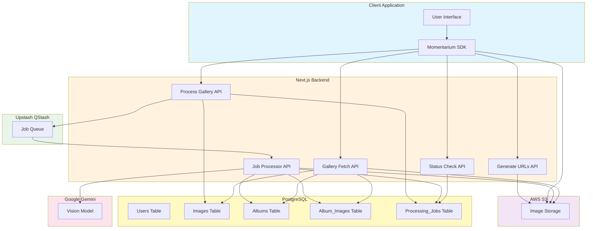
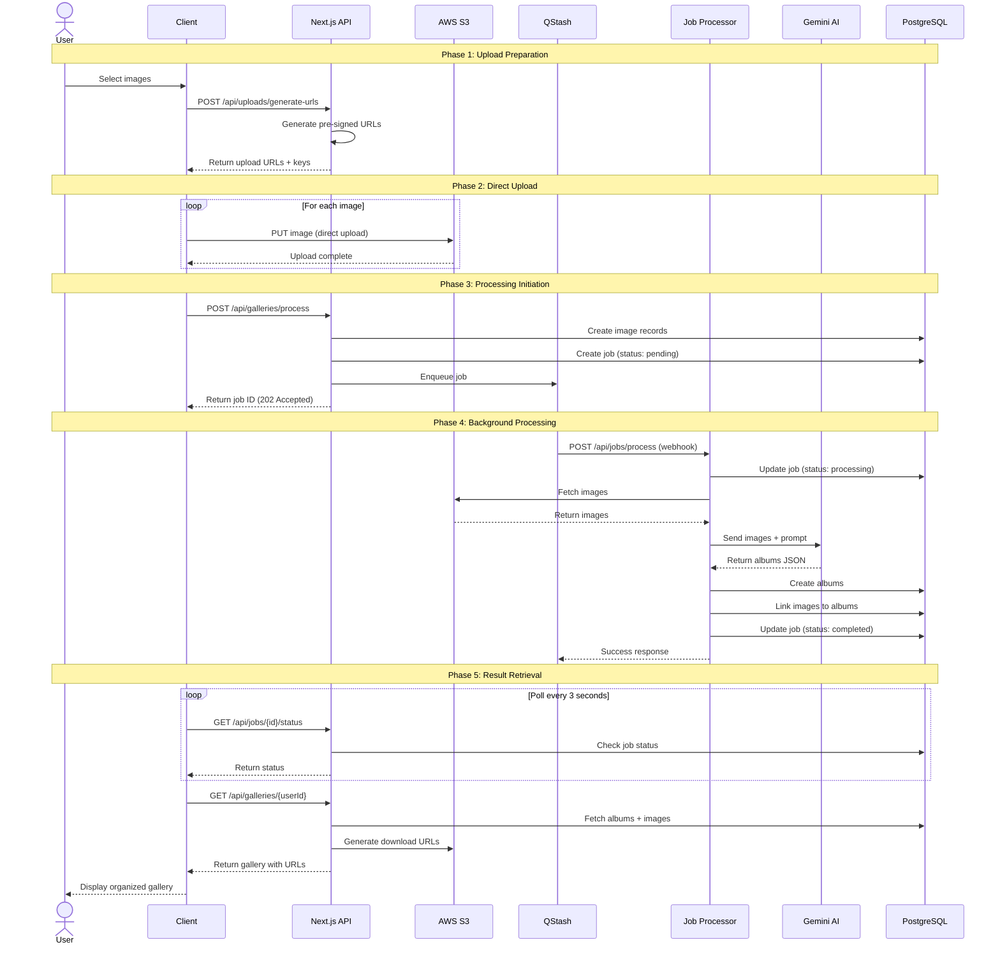
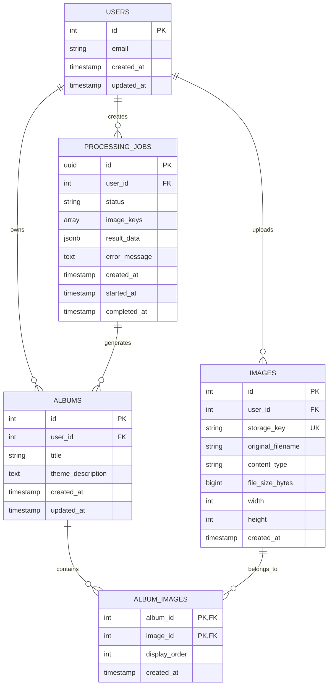
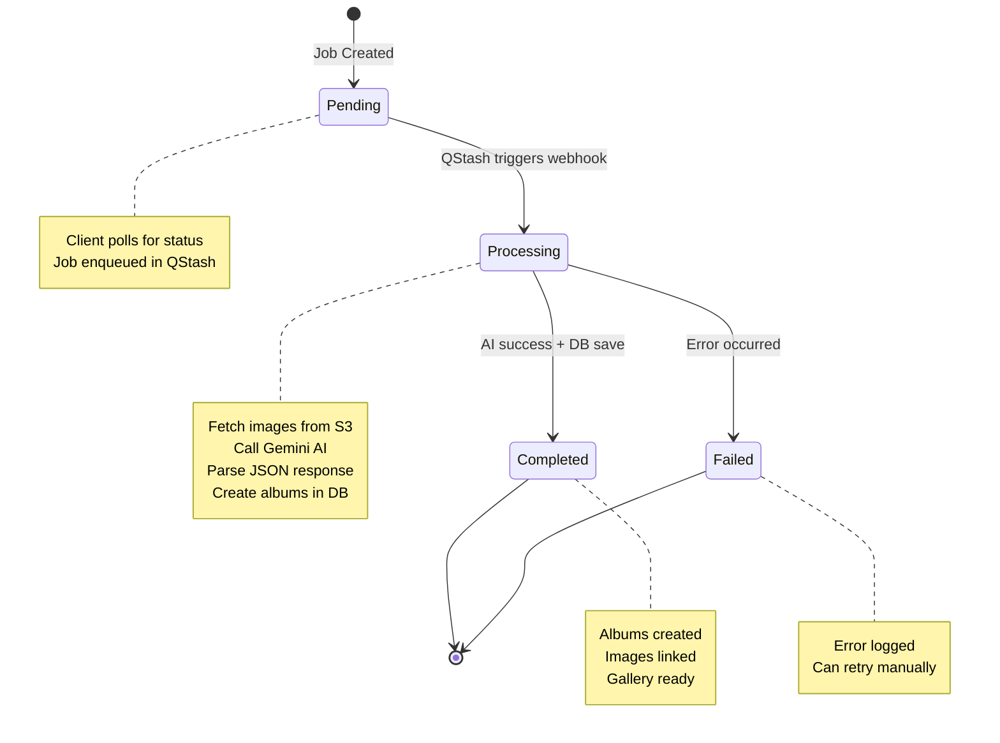
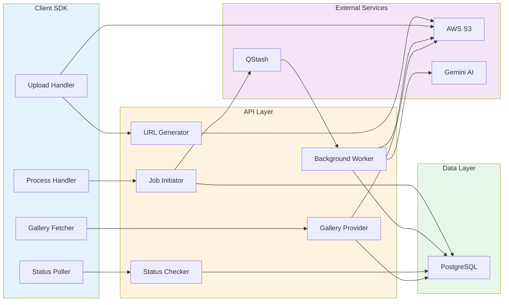
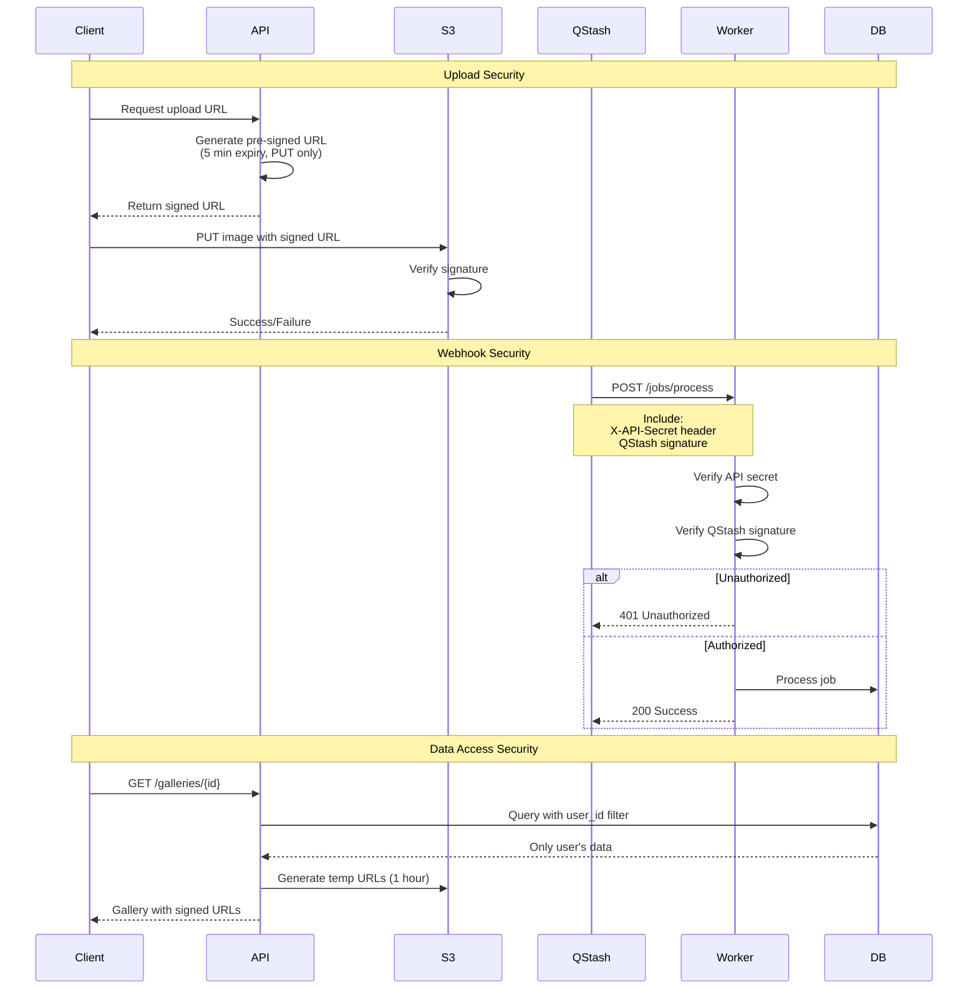
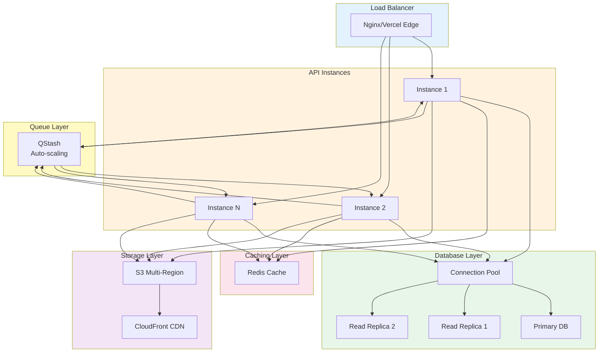
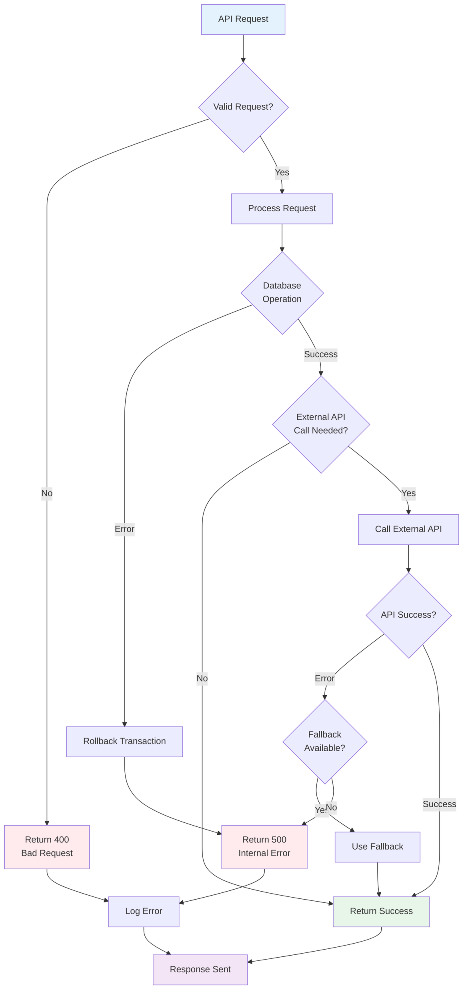

# Momentarium Architecture Diagrams

This document contains visual diagrams of the Momentarium architecture.

## System Architecture



## Sequence Diagram: Complete Upload Flow



## Data Model Diagram



## State Diagram: Job Processing



## Component Interaction Diagram



## Deployment Architecture

```mermaid
graph TB
    subgraph Internet["Internet"]
        Users[Users/Clients]
    end

    subgraph Vercel["Vercel Platform"]
        Edge[Edge Network]
        Functions[Serverless Functions]
        subgraph APIs["API Routes"]
            API1[/uploads/generate-urls]
            API2[/galleries/process]
            API3[/jobs/process]
            API4[/jobs/status]
            API5[/galleries/id]
        end
    end

    subgraph AWS["AWS"]
        S3[S3 Bucket]
        CloudFront[CloudFront CDN]
    end

    subgraph Upstash["Upstash"]
        QStash[QStash Queue]
    end

    subgraph Google["Google Cloud"]
        Gemini[Gemini AI API]
    end

    subgraph DBHost["Database Host"]
        Postgres[PostgreSQL]
    end

    Users --> Edge
    Edge --> Functions
    Functions --> APIs
    API1 --> S3
    API2 --> QStash
    API2 --> Postgres
    QStash --> API3
    API3 --> S3
    API3 --> Gemini
    API3 --> Postgres
    API4 --> Postgres
    API5 --> Postgres
    API5 --> S3
    S3 --> CloudFront
    CloudFront --> Users

    style Internet fill:#e1f5ff
    style Vercel fill:#000000,color:#ffffff
    style AWS fill:#ff9900
    style Upstash fill:#00e676
    style Google fill:#4285f4,color:#ffffff
    style DBHost fill:#336791,color:#ffffff
```

## Security Flow Diagram



## Scaling Architecture



## Error Handling Flow



---

These diagrams can be viewed in any Markdown renderer that supports Mermaid (GitHub, GitLab, VS Code with extensions, etc.)


